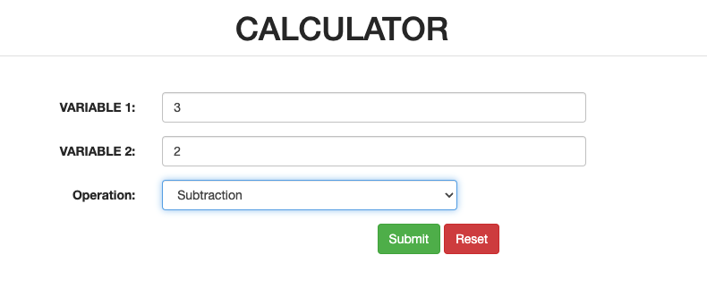

# Calculator by Python Flask (Microservice on AWS App Runner)
Hello, Here is a simple flask application of Calculator which performs following Operations:

- Addition (OPERATION: +)

- Subtraction (OPERATION: -)

- Multiplication (OPERATION: *)

- Division (OPERATION: /)

Inside template/

- form.html

This carry data i.e. variables on which operations to be performed and operation code which has to be performed on variables.

- result.html

This displays the result of the user query.
__This service is available at https://vsbmgxgs8v.us-east-1.awsapprunner.com/__
# Example:

- Addition (3+2)
- Answer: 5
  

